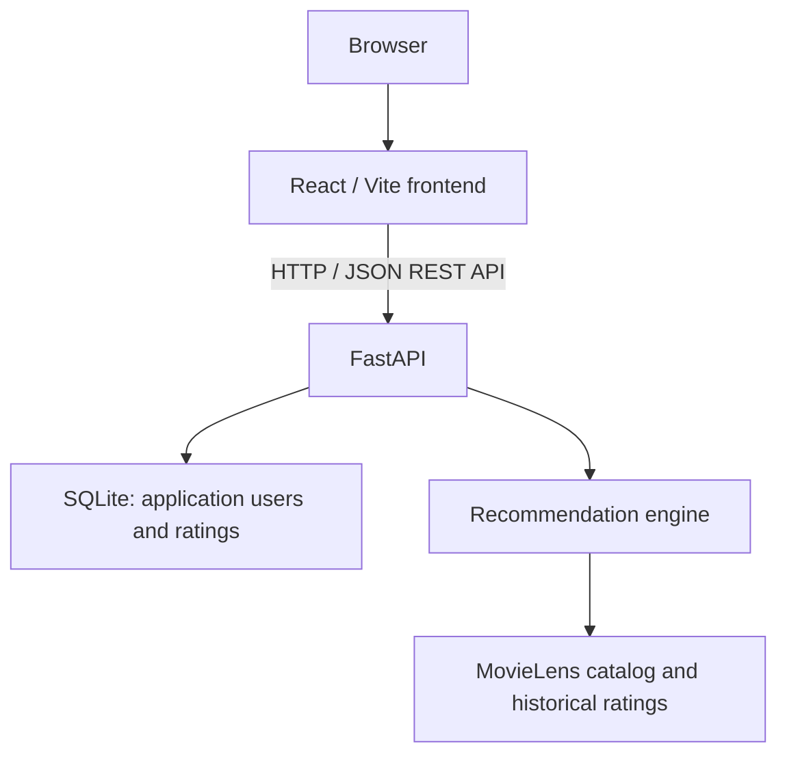

# Movie Recommender

A full-stack movie recommendation application where users search the MovieLens catalog, rate films, and receive personalized recommendations. The user-user collaborative-filtering algorithm is implemented directly in Python in this repository, with a React interface, persistent ratings, and a tested REST API around it.

**Python · FastAPI · React / Vite · SQLite · SQLAlchemy · Docker · GitHub Actions**

## Features

- Search movies by title and create or select an application user by ID.
- Rate and rerate movies from 0.5 to 5.0; saved ratings persist across restarts.
- Get personalized recommendations with predicted ratings and evidence confidence.
- Explore popular movies or recommendations within a MovieLens genre.
- Combine multiple users' saved preferences for group recommendations.
- Filter every recommendation mode by release decade.

## How It Works



At startup, FastAPI validates the MovieLens CSVs and prepares historical users' sparse rating profiles: dictionaries containing only the movies each user rated. These reference users remain separate from application users, whose ratings are stored through SQLAlchemy in `data/application.db`. Catalog titles and genres stay in the CSVs; SQLite registers movie IDs to enforce valid rating references.

The personalized pipeline in [app/recommender.py](app/recommender.py) works as follows:

1. **Find similar users.** Pearson correlation compares the target's ratings with each historical user's ratings on overlapping movies, centered around each shared profile's mean. Insufficient overlap or effectively zero variance gives zero similarity. The engine selects up to 15 neighbors with positive correlation by default.
2. **Predict unseen movies.** For each candidate, start with the target's overall mean rating and add a similarity-weighted average of contributing neighbors' deviations from their own overall means. Only neighbors who rated that movie contribute. Already-rated movies are excluded, and predictions are bounded to 0.5–5.0.
3. **Add a secondary genre signal.** Ratings above or below the target's mean indicate relative genre preferences. Sparse genre evidence is shrunk toward neutral, then used for a small, bounded adjustment scaled by recommendation confidence. Genre matching alone cannot create an unsupported prediction.
4. **Rank with evidence.** Confidence reflects contributing neighbors' similarities and overlap counts. It measures supporting evidence, **not the probability that the user will like the movie**. Ranking shrinks the adjusted prediction toward the mean of all historical ratings according to confidence, reducing the dominance of weakly supported high predictions. The interface displays the bounded prediction and confidence; the internal ranking score determines order.

No LensKit recommender is used. Pearson similarity, neighbor selection, prediction, confidence, and ranking are implemented here.

With fewer than two ratings, or no usable collaborative-filtering candidates, the engine falls back to historical average ratings from movies meeting a configurable minimum rating count (20 by default). Popular and genre recommendations use this same average-and-count approach. Fallback results are labeled as historical averages and carry no CF confidence; short personalized lists are not padded with popularity results.

Decade selection restricts candidates before ranking and limiting, including fallback candidates. Release years come from trailing years in MovieLens titles; movies with unknown years are excluded when a decade is selected. Groups average the supplied ratings for each movie, preserve ratings supplied by only one member, and run the same pipeline while excluding movies rated by any member. This simple combination can hide disagreements between members.

## Running Locally

Use **Python 3.14** and **Node.js 24**, matching the CI runtime families. Clone the repository and enter its directory:

```sh
git clone https://github.com/aanxnd/movie-recommender.git
cd movie-recommender
```

Create a Python environment and install backend dependencies. On Windows PowerShell:

```powershell
python -m venv .venv
.\.venv\Scripts\python.exe -m pip install -r requirements.txt
.\.venv\Scripts\python.exe -m uvicorn app.main:app --reload
```

On macOS/Linux:

```sh
python3.14 -m venv .venv
.venv/bin/python -m pip install -r requirements.txt
.venv/bin/python -m uvicorn app.main:app --reload
```

In a second terminal, from the repository root:

```sh
cd frontend
npm ci
npm run dev
```

Open **[http://127.0.0.1:5173](http://127.0.0.1:5173)** for the application and **[http://127.0.0.1:8000/docs](http://127.0.0.1:8000/docs)** for FastAPI's interactive API documentation. Create a user and keep its ID, search for movies, save a few ratings, then request recommendations.

The React frontend calls the FastAPI REST API using native `fetch()`. During development, Vite forwards `/api/*` requests to `127.0.0.1:8000` and removes the prefix. The backend initializes SQLite automatically and loads the included reference data without a dataset download.

### Tests and CI

Run the backend suite from the repository root:

```powershell
.\.venv\Scripts\python.exe -m pytest -q -p no:cacheprovider
```

On macOS/Linux, use `.venv/bin/python -m pytest -q -p no:cacheprovider`. Tests cover recommendation mathematics and ranking, cold start, genres and groups, decade filtering, data validation, persistence, API behavior, and invalid inputs. They use small synthetic datasets and temporary databases, leaving application ratings untouched.

To build the frontend production bundle, run `npm run build` in `frontend/`; output goes to `frontend/dist/`.

[GitHub Actions](.github/workflows/tests.yml) is configured to run independent backend-test and frontend-build jobs on pushes to `main` and pull requests targeting `main`, using fresh Ubuntu runners. It installs Python dependencies, validates the included MovieLens data offline, runs pytest, and installs frontend dependencies with `npm ci` before building.

### Docker

With Docker running Linux containers, build and run the backend from the repository root:

```sh
docker build -t movie-recommender-backend .
docker run -p 8000:8000 movie-recommender-backend
```

Free port 8000 first by stopping any local backend. API documentation is available at **[http://localhost:8000/docs](http://localhost:8000/docs)**. The image packages FastAPI, Python dependencies, and the required MovieLens files; the React/Vite frontend remains separate and can use it through the development proxy above.

To preserve application users and ratings across replacement containers, use a named volume instead of the basic run command:

```sh
docker volume create movie-recommender-data
docker run --name movie-recommender-api -p 8000:8000 --mount type=volume,source=movie-recommender-data,target=/backend/data movie-recommender-backend
```

A new empty named volume receives the image's reference files and stores SQLite alongside them. Reuse that volume for replacement containers. Without a volume, data survives stop/start of the same container but is lost when that container is removed. An empty host bind mount at `/backend/data` would hide the required CSVs.

## Data

The project uses **MovieLens latest-small** from [GroupLens Research at the University of Minnesota](https://grouplens.org/datasets/movielens/latest/). The included snapshot contains 9,742 movies and 100,836 historical ratings from 610 users. Historical ratings provide collaborative-filtering reference profiles; application-created ratings remain separate in SQLite.

`data/movies.csv`, `data/ratings.csv`, and the upstream [data/README.txt](data/README.txt) are tracked so fresh clones and CI can operate without runtime dataset downloads. Generated application databases are ignored by Git. The dataset's usage and redistribution conditions are retained in that README, including its requirement for permission for commercial or revenue-bearing use.

Dataset citation: F. Maxwell Harper and Joseph A. Konstan (2015). *The MovieLens Datasets: History and Context*. ACM Transactions on Interactive Intelligent Systems, 5(4), Article 19. [doi:10.1145/2827872](https://doi.org/10.1145/2827872).
