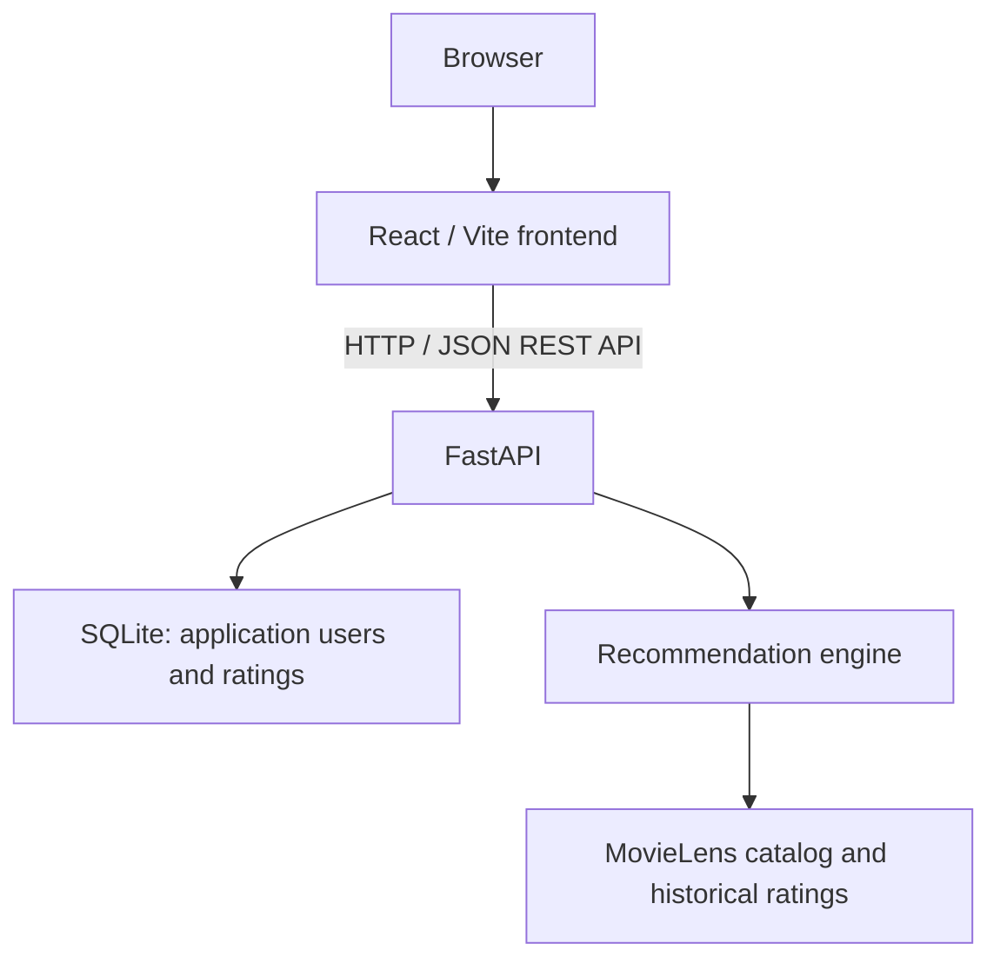

# Movie Recommender

A full-stack movie recommendation application where users search the MovieLens catalog, rate films, and receive personalized recommendations. The user-user collaborative-filtering algorithm is implemented directly in Python in this repository, with a React interface, persistent ratings, and a tested REST API around it.

**Python · FastAPI · React / Vite · SQLite · SQLAlchemy · Docker · GitHub Actions**

## Features

- Search movies by title and create or select an application user by ID.
- Rate and rerate movies from 0.5 to 5.0; saved ratings persist across restarts.
- Get personalized recommendations with predicted ratings and evidence confidence.
- Explore popular movies or recommendations within a MovieLens genre.
- Combine multiple users' saved preferences for group recommendations.
- Filter every recommendation mode by release decade.

## How It Works



Acquire and prepare MovieLens 32M explicitly before starting FastAPI. Startup memory-maps read-only numeric profile arrays, movie-to-user postings, precomputed statistics, and catalog metadata. These reference users remain separate from application users, whose ratings are stored through SQLAlchemy in `data/application.db`. SQLite registers movie IDs to enforce valid rating references.

The personalized pipeline in [app/recommender.py](app/recommender.py) works as follows:

1. **Find similar users.** Pearson correlation compares ratings on shared movies, centered around each shared profile's mean. Insufficient overlap or effectively zero variance gives zero similarity. Positive correlations are weighted by `overlap / (overlap + 10)` before selecting up to 15 neighbors, so perfect correlations from two shared movies do not dominate better-supported matches.
2. **Predict unseen movies.** Start with the target's overall mean and calculate a weighted average of contributing neighbors' deviations from their own overall means. Adjusted similarities also determine candidate evidence `E`, with overlap evidence scaling up to five shared movies. Multiply the CF deviation by `E / (E + 5)` before adding it to the target mean and bounding the prediction to 0.5–5.0. Only neighbors who rated that movie contribute; already-rated movies are excluded.
3. **Add a secondary genre signal.** Ratings above or below the target's mean indicate relative genre preferences. Sparse genre evidence is shrunk toward neutral, then used for a small, bounded adjustment scaled by recommendation confidence. Genre matching alone cannot create an unsupported prediction.
4. **Rank with evidence.** Confidence is `E / (E + 3)`: a supporting-evidence heuristic, **not a calibrated probability or guarantee of accuracy**. Ranking shrinks the genre-adjusted prediction toward the historical global mean according to confidence. The interface displays the bounded prediction and confidence; the internal ranking score determines order.

No LensKit recommender is used. Pearson similarity, neighbor selection, prediction, confidence, and ranking are implemented here.

With fewer than two ratings, or no usable collaborative-filtering candidates, the engine falls back to historical average ratings from movies meeting a configurable minimum rating count (20 by default). Popular and genre recommendations use this same average-and-count approach. Fallback results are labeled as historical averages and carry no CF confidence; short personalized lists are not padded with popularity results.

Decade selection restricts candidates before ranking and limiting, including fallback candidates. Release years come from trailing years in MovieLens titles; movies with unknown years are excluded when a decade is selected. Groups average the supplied ratings for each movie, preserve ratings supplied by only one member, and run the same pipeline while excluding movies rated by any member. This simple combination can hide disagreements between members.

## Running Locally

Use **Python 3.14** and **Node.js 24**, matching the CI runtime families. Clone the repository and enter its directory:

```sh
git clone https://github.com/aanxnd/movie-recommender.git
cd movie-recommender
```

Create a Python environment and install backend dependencies. On Windows PowerShell:

```powershell
python -m venv .venv
.\.venv\Scripts\python.exe -m pip install -r requirements.txt
.\.venv\Scripts\python.exe scripts/load_movielens.py --dataset ml-32m --download
.\.venv\Scripts\python.exe scripts/prepare_movielens.py --source data/raw/ml-32m --output data/prepared/ml-32m-v1 --dataset ml-32m
.\.venv\Scripts\python.exe -m uvicorn app.main:app --reload
```

On macOS/Linux:

```sh
python3.14 -m venv .venv
.venv/bin/python -m pip install -r requirements.txt
.venv/bin/python scripts/load_movielens.py --dataset ml-32m --download
.venv/bin/python scripts/prepare_movielens.py --source data/raw/ml-32m --output data/prepared/ml-32m-v1 --dataset ml-32m
.venv/bin/python -m uvicorn app.main:app --reload
```

In a second terminal, from the repository root:

```sh
cd frontend
npm ci
npm run dev
```

Open **[http://127.0.0.1:5173](http://127.0.0.1:5173)** for the application and **[http://127.0.0.1:8000/docs](http://127.0.0.1:8000/docs)** for FastAPI's interactive API documentation. Create a user and keep its ID, search for movies, save a few ratings, then request recommendations.

The React frontend calls the FastAPI REST API using native `fetch()`. During development, Vite forwards `/api/*` requests to `127.0.0.1:8000` and removes the prefix. The backend initializes SQLite automatically. Acquisition stores the 32M archive in `data/raw/ml-32m.zip` and extracts source files into `data/raw/ml-32m/`; use `--archive PATH` instead of `--download` for an existing official ZIP. Acquisition refuses to overwrite an existing 32M source directory, and preparation refuses to overwrite existing artifacts.

The application defaults to repository-relative `data/prepared/ml-32m-v1/`. Set `MOVIELENS_PREPARED_DIR` to select another prepared directory. Startup never downloads or prepares data and fails with setup instructions when artifacts are missing; it never silently falls back to Small.

For explicit lightweight development, prepare the tracked Small snapshot with `python scripts/prepare_movielens.py --source data --output data/prepared/latest-small-v1 --dataset latest-small`, then set `MOVIELENS_PREPARED_DIR` before starting Uvicorn: `$env:MOVIELENS_PREPARED_DIR = 'data/prepared/latest-small-v1'` in PowerShell, or `export MOVIELENS_PREPARED_DIR=data/prepared/latest-small-v1` on macOS/Linux.

### Tests and CI

Run the backend suite from the repository root:

```powershell
.\.venv\Scripts\python.exe -m pytest -q -p no:cacheprovider
```

On macOS/Linux, use `.venv/bin/python -m pytest -q -p no:cacheprovider`. Tests cover recommendation mathematics and ranking, cold start, genres and groups, decade filtering, data validation, persistence, API behavior, and invalid inputs. Normal tests use tracked Small or synthetic datasets and temporary databases, leaving application ratings untouched. Deterministic 32M equivalence checks are opt-in.

To build the frontend production bundle, run `npm run build` in `frontend/`; output goes to `frontend/dist/`.

The offline quality harness uses deterministic, disjoint development/validation/test users, removes validation/test users from reference ratings and statistics, and reports error, coverage, top-10 retrieval, support, clipping, and confidence diagnostics. Parameters are selected on validation users and frozen before one test run. With existing prepared 32M artifacts, run these phases in order:

```powershell
.\.venv\Scripts\python.exe scripts/evaluate_recommender.py --phase train
.\.venv\Scripts\python.exe scripts/evaluate_recommender.py --phase validation
.\.venv\Scripts\python.exe scripts/evaluate_recommender.py --phase select
.\.venv\Scripts\python.exe scripts/evaluate_recommender.py --phase test
```

Results stay under ignored `data/evaluation/`. The default sample is 300 users across five profile-size strata, bounded at 1,999 ratings per user. Use `--output` for a new experiment directory; completed phases refuse overwrites. This is an offline evaluation, not a startup or CI workload.

[GitHub Actions](.github/workflows/tests.yml) runs independent backend-test and frontend-build jobs on pushes to `main` and pull requests targeting `main`. Backend verification prepares the tracked Small snapshot offline, checks prepared application startup, and runs pytest. The frontend job installs dependencies with `npm ci` before building. Prepared data is not uploaded or retained.

### Docker

Acquire and prepare 32M as above. With Docker running Linux containers, build the backend from the repository root:

```sh
docker build -t movie-recommender-backend .
```

Free port 8000 first by stopping any local backend. The image packages code and Python dependencies; prepared reference data is mounted read-only. The React/Vite frontend remains separate.

Run with separate reference and application-data mounts. On Windows PowerShell:

```powershell
docker volume create movie-recommender-data
docker run --name movie-recommender-api -p 8000:8000 -e MOVIELENS_PREPARED_DIR=/backend/reference --mount "type=bind,source=$((Resolve-Path data/prepared/ml-32m-v1).Path),target=/backend/reference,readonly" --mount type=volume,source=movie-recommender-data,target=/backend/data movie-recommender-backend
```

On macOS/Linux, use `source="$(pwd)/data/prepared/ml-32m-v1"` in the bind mount. API documentation is available at **[http://localhost:8000/docs](http://localhost:8000/docs)**. `/backend/reference` contains immutable prepared 32M data; `/backend/data/application.db` is writable SQLite. The image contains no dataset and has no Small fallback. Reuse the named volume for replacement containers. Omitting that volume loses application data when the container is removed.

The container runs as UID 10001. Existing application-data volumes must be writable by that user; reference mounts only need read access. New named volumes inherit the image's application-data directory ownership.

## Production deployment readiness

No backend provider has been selected or verified. The frontend can remain on Vercel; the backend supports PostgreSQL through SQLAlchemy/Psycopg while local development continues to use SQLite. With no configuration, `python -m uvicorn app.main:app --reload` retains the existing prepared-data/SQLite workflow and never downloads data. Explicit database paths passed by tests or local callers override `DATABASE_URL`. The frontend still uses `/api` through Vite's development proxy when its API base is unset.

Configure these variables on the relevant service:

| Variable | Service | Purpose |
|---|---|---|
| `VITE_API_BASE_URL` | Frontend build | Public HTTPS backend origin, without `/api`; trailing slashes are normalized. Rebuild the frontend after changing it. |
| `DATABASE_URL` | Backend secret | PostgreSQL connection string, including TLS parameters. Plain PostgreSQL URLs are normalized to `postgresql+psycopg`. Never put this in a `VITE_*` variable or commit it. |
| `CORS_ALLOWED_ORIGINS` | Backend | Exact comma-separated frontend origins, without trailing paths/slashes; no wildcard fallback. GET/POST/PUT and Content-Type are allowed, without credentials. |
| `MOVIELENS_PREPARED_DIR` | Backend | Prepared directory on disk-backed storage. Docker defaults to `/backend/data/reference/ml-32m-v1`; set `/backend/reference` for an external reference mount. |
| `MOVIELENS_ARCHIVE_URL` | Backend | Opt-in trusted GitHub Release download URL; omit when supplying prepared data locally. |
| `MOVIELENS_ARCHIVE_SHA256` | Backend | Required pinned SHA-256 when archive downloading is enabled. |
| `PORT` | Backend | Listening port; defaults to 8000. |

For the published prepared release, use:

```text
MOVIELENS_ARCHIVE_URL=https://github.com/aanxnd/movie-recommender/releases/download/data-v1/ml-32m-v1.tar.gz
MOVIELENS_ARCHIVE_SHA256=1e7fc9d6c664cff0f697438996e31ed6cf40cd7570aee43e31b814f0e505c303
```

Start the deployment runtime with `python -m app.runtime`. It verifies existing prepared artifacts or downloads the configured archive, verifies SHA-256, inspects a bounded file inventory, safely extracts into staging, and atomically publishes the directory. OS locking coordinates concurrent startup attempts. A verification marker outside the dataset allows unchanged files to be reused without rehashing; administrator-supplied files are checked against their manifest and distinguished from a verified downloaded archive. The compressed archive is removed after publication. Downloading is streamed, limited to 200 MiB, with three transport attempts and 30-second socket timeouts; extraction is limited to 600 MiB. Only HTTPS release URLs for this repository and trusted GitHub asset redirects are accepted. Full semantic verification/preprocessing is not performed at startup.

The runtime binds `0.0.0.0`, uses **one Uvicorn worker**, and disables reload. Personal and group recommendation routes share a nonblocking capacity guard: **one expensive computation per process**; overload returns HTTP 503 with Retry-After. Popular/genre/search/health routes remain available. `/health` is cheap liveness; `/ready` checks initialized reference data and a bounded database query, returning a sanitized 503 when unavailable. Readiness uses one disposable probe process at a time with a three-second total budget, including cleanup; a stalled probe is terminated rather than leaving blocked threads. Its fresh database connection bypasses the application's pool. PostgreSQL application requests retain the two-connection pool with no overflow and bounded connection/pool waits.

Plan for at least approximately **1 GiB RAM**, with **1–1.5 GiB preferred and 2 GiB safer**; 512 MiB is below measured workload requirements. These are planning estimates, requiring Linux/host verification. Allow approximately **1 GiB writable ephemeral disk minimum, 2 GiB preferred**, excluding image storage; archive and extraction briefly coexist. Use disk-backed storage rather than tmpfs. Allow several minutes for first startup and at least 60 seconds for requests. Persistent backend disk is unnecessary when PostgreSQL stores application ratings, but fresh ephemeral instances may redownload the archive. Keep normal portfolio usage within a verified $0/no-card host's limits.

This remains an unauthenticated public demo: IDs are not access-control secrets. Do not store sensitive ratings/profile information. Configure exact CORS origins and keep database credentials in backend secret settings. No deployment, cloud configuration, authentication, or recommendation tuning is included in this readiness stage.

Run `npm test` in `frontend/` for dependency-free API URL tests. Backend CI uses synthetic bootstrap archives and tracked Small data; it never downloads 32M or requires Neon. Optional PostgreSQL integration uses `POSTGRES_TEST_URL` pointing **only to a disposable localhost PostgreSQL container**, then `python -m pytest tests/test_postgresql.py -q`; without that variable, the test is skipped. It creates/removes an isolated temporary schema, not application tables in the default schema.

## Data

The normal application uses **MovieLens 32M** from GroupLens Research at the University of Minnesota. The tracked **MovieLens latest-small** [snapshot](https://grouplens.org/datasets/movielens/latest/) contains 9,742 movies and 100,836 historical ratings from 610 users and remains available for tests, CI, equivalence reference, and explicit lightweight development. Historical ratings provide collaborative-filtering reference profiles; application-created ratings remain separate in SQLite.

`data/movies.csv`, `data/ratings.csv`, and the upstream [data/README.txt](data/README.txt) are tracked for offline Small tests and CI. Large 32M archives/source files, prepared artifacts, local benchmark records, and application databases are ignored by Git and intentionally not committed. Acquisition retains the upstream 32M README alongside its source files; consult the corresponding upstream README for each dataset's usage conditions.

Dataset citation: F. Maxwell Harper and Joseph A. Konstan (2015). *The MovieLens Datasets: History and Context*. ACM Transactions on Interactive Intelligent Systems, 5(4), Article 19. [doi:10.1145/2827872](https://doi.org/10.1145/2827872).
